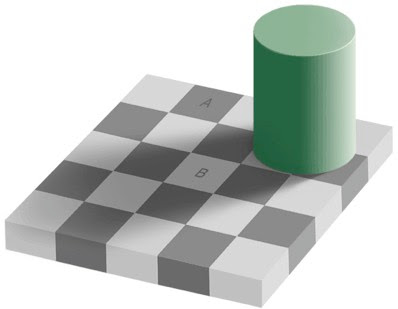

# Session 04

## Python Programming

## Homework discussion

### Read the Article: [Your Brain Is an Energy-Efficient 'Prediction Machine'](https://www.wired.com/story/your-brain-is-an-energy-efficient-prediction-machine/)

### Optional: [In Search Of A Flat Earth](https://www.youtube.com/watch?v=JTfhYyTuT44)

## Jupyter Notebook

[Today's Jupyter Notebook](./programming.ipynb)

## Feedback

Please helps us filling up the **[Feedback Form](https://docs.google.com/forms/d/e/1FAIpQLSf-yrrCkg66KFFimIk62me8jkSybb9wY1tdqhuRNKG1pchk5w/viewform)**.

## Next session

We will learn more about Python as a Language.

## Homework

None for today.
